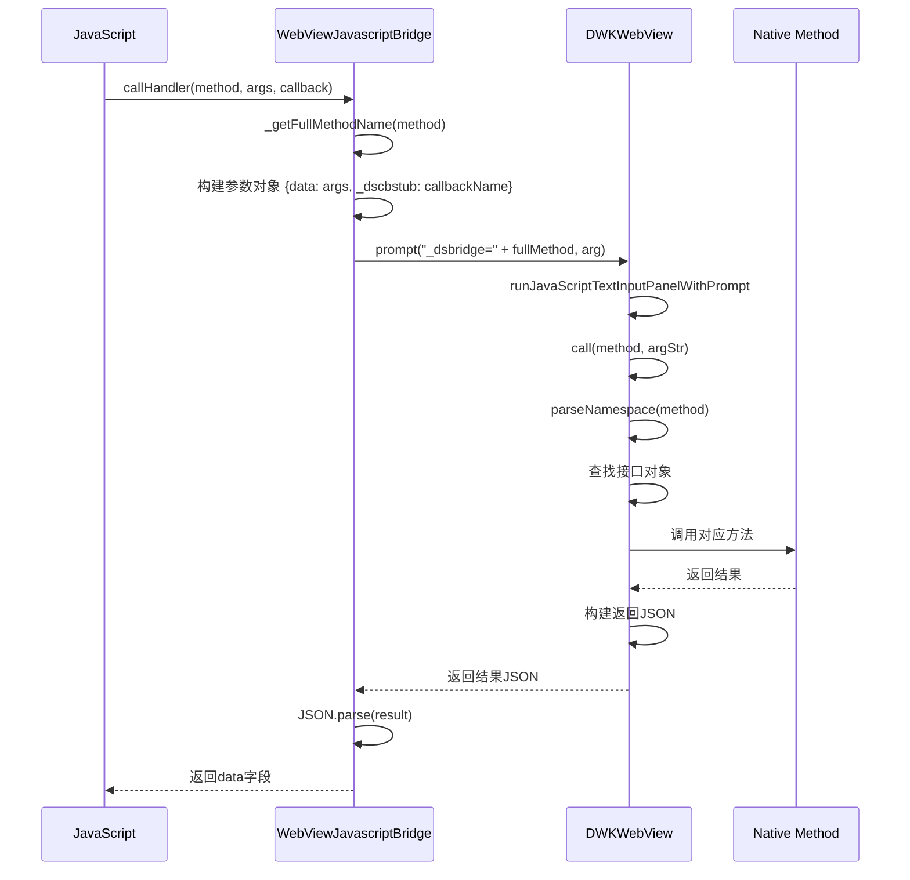
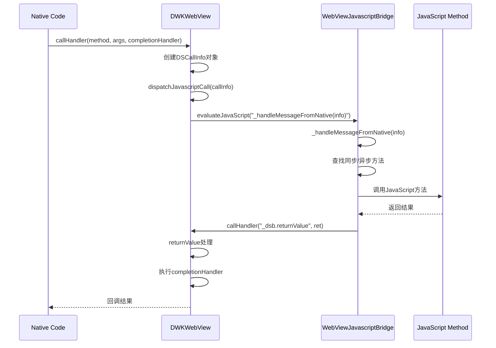
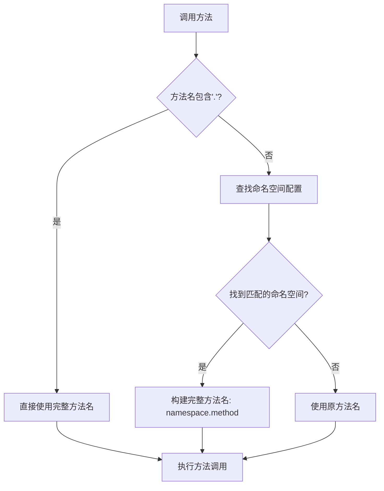

# DSBridge-IOS 详细设计说明

## 项目概述

DSBridge-IOS 是一个用于 iOS 平台的原生与 JavaScript 双向通信桥接库，基于 WKWebView 实现。它提供了简洁易用的 API，支持同步和异步方法调用，并引入了命名空间机制来更好地组织和管理桥接方法。

## 核心架构

### 整体架构图

```
┌─────────────────────────────────────────────────────────────┐
│                    DSBridge 架构                            │
├─────────────────────────────────────────────────────────────┤
│  JavaScript 层                                              │
│  ┌─────────────────────────────────────────────────────────┐ │
│  │           WebViewJavascriptBridge.js                   │ │
│  │  ┌─────────────────┐  ┌─────────────────────────────┐   │ │
│  │  │   Bridge API    │  │     Namespace Manager       │   │ │
│  │  │                 │  │                             │   │ │
│  │  │ • callHandler   │  │ • _namespaces               │   │ │
│  │  │ • registerHandler│  │ • _getFullMethodName       │   │ │
│  │  │ • hasNativeMethod│  │ • configureNamespace       │   │ │
│  │  └─────────────────┘  └─────────────────────────────┘   │ │
│  └─────────────────────────────────────────────────────────┘ │
├─────────────────────────────────────────────────────────────┤
│  通信层 (WKWebView)                                         │
│  ┌─────────────────────────────────────────────────────────┐ │
│  │              WKWebView 通信机制                        │ │
│  │  ┌─────────────────┐  ┌─────────────────────────────┐   │ │
│  │  │   prompt()      │  │     evaluateJavaScript()    │   │ │
│  │  │   (JS→Native)   │  │     (Native→JS)             │   │ │
│  │  └─────────────────┘  └─────────────────────────────┘   │ │
│  └─────────────────────────────────────────────────────────┘ │
├─────────────────────────────────────────────────────────────┤
│  Native 层 (Objective-C)                                    │
│  ┌─────────────────────────────────────────────────────────┐ │
│  │                DWKWebView                              │ │
│  │  ┌─────────────────┐  ┌─────────────────────────────┐   │ │
│  │  │  Method Proxy   │  │     Namespace Manager       │   │ │
│  │  │                 │  │                             │   │ │
│  │  │ • DSBridgeMethod│  │ • javaScriptNamespace       │   │ │
│  │  │   Proxy         │  │   Interfaces                │   │ │
│  │  │ • registerMethod│  │ • addJavascriptObject       │   │ │
│  │  └─────────────────┘  └─────────────────────────────┘   │ │
│  └─────────────────────────────────────────────────────────┘ │
└─────────────────────────────────────────────────────────────┘
```

## 核心组件详细分析

### 1. DWKWebView (Native 端核心组件)

#### 1.1 类继承关系
```objective-c
@interface DWKWebView : WKWebView <WKUIDelegate>
```

DWKWebView 继承自 WKWebView 并实现了 WKUIDelegate 协议，这是整个桥接系统的核心。

#### 1.2 关键属性

```objective-c
// 核心数据结构
NSMutableDictionary<NSString *,id> *javaScriptNamespaceInterfaces;  // 命名空间接口映射
NSMutableDictionary *handerMap;                                     // 回调处理器映射
NSMutableArray<DSCallInfo *> * callInfoList;                        // 调用信息队列
NSString *jsCache;                                                  // JavaScript 代码缓存
```

#### 1.3 初始化过程

```objective-c
-(instancetype)initWithFrame:(CGRect)frame configuration:(WKWebViewConfiguration *)configuration
{
    // 1. 初始化基础属性
    callInfoList=[NSMutableArray array];
    javaScriptNamespaceInterfaces=[NSMutableDictionary dictionary];
    handerMap=[NSMutableDictionary dictionary];
    
    // 2. 注入标识脚本
    WKUserScript *script = [[WKUserScript alloc] initWithSource:@"window._dswk=true;"
                                                  injectionTime:WKUserScriptInjectionTimeAtDocumentStart
                                               forMainFrameOnly:YES];
    [configuration.userContentController addUserScript:script];
    
    // 3. 设置 UIDelegate
    super.UIDelegate=self;
    
    // 4. 添加内部 API 对象
    InternalApis *interalApis= [[InternalApis alloc] init];
    interalApis.webview=self;
    [self addJavascriptObject:interalApis namespace:@"_dsb"];
    
    return self;
}
```

#### 1.4 核心通信机制

##### JavaScript 调用 Native 方法

通过 `prompt()` 方法实现：

```objective-c
- (void)webView:(WKWebView *)webView runJavaScriptTextInputPanelWithPrompt:(NSString *)prompt
    defaultText:(nullable NSString *)defaultText initiatedByFrame:(WKFrameInfo *)frame
completionHandler:(void (^)(NSString * _Nullable result))completionHandler
{
    NSString * prefix=@"_dsbridge=";
    if ([prompt hasPrefix:prefix])
    {
        NSString *method= [prompt substringFromIndex:[prefix length]];
        NSString *result = [self call:method :defaultText];
        completionHandler(result);
    }
    // ... 处理其他 prompt 调用
}
```

##### Native 调用 JavaScript 方法

通过 `evaluateJavaScript` 实现：

```objective-c
- (void) dispatchJavascriptCall:(DSCallInfo*) info{
    NSString * json=[JSBUtil objToJsonString:@{@"method":info.method,@"callbackId":info.id,
                                               @"data":[JSBUtil objToJsonString: info.args]}];
    [self evaluateJavaScript:[NSString stringWithFormat:@"window._handleMessageFromNative(%@)",json]
           completionHandler:nil];
}
```

#### 1.5 方法注册和管理

##### 传统对象注册方式
```objective-c
- (void) addJavascriptObject:(id)object namespace:(NSString *)namespace{
    if(namespace==nil){
        namespace=@"";
    }
    if(object!=NULL){
        [javaScriptNamespaceInterfaces setObject:object forKey:namespace];
    }
}
```

##### 新的方法注册方式
```objective-c
- (void)registerBridgeMethod:(NSString *)methodName 
                     handler:(id)handler 
                   namespace:(NSString *)namespace {
    // 获取或创建代理对象
    DSBridgeMethodProxy *proxyObject = [javaScriptNamespaceInterfaces objectForKey:namespace];
    if (proxyObject == nil || ![proxyObject isKindOfClass:[DSBridgeMethodProxy class]]) {
        proxyObject = [[DSBridgeMethodProxy alloc] init];
        [javaScriptNamespaceInterfaces setObject:proxyObject forKey:namespace];
    }
    
    // 注册方法到代理对象
    [proxyObject registerMethod:methodName withHandler:handler];
}
```

#### 1.6 方法调用处理

```objective-c
-(NSString *)call:(NSString*) method :(NSString*) argStr
{
    // 1. 解析命名空间和方法名
    NSArray *nameStr=[JSBUtil parseNamespace:[method stringByTrimmingCharactersInSet:[NSCharacterSet whitespaceCharacterSet]]];
    
    // 2. 获取对应的接口对象
    id JavascriptInterfaceObject=javaScriptNamespaceInterfaces[nameStr[0]];
    
    // 3. 查找同步或异步方法
    NSString *methodOne = [JSBUtil methodByNameArg:1 selName:nameStr[1] class:[JavascriptInterfaceObject class]];
    NSString *methodTwo = [JSBUtil methodByNameArg:2 selName:nameStr[1] class:[JavascriptInterfaceObject class]];
    
    // 4. 执行方法调用
    if([JavascriptInterfaceObject respondsToSelector:selasyn]){
        // 异步调用
        void (^completionHandler)(id,BOOL) = ^(id value,BOOL complete){
            // 处理回调结果
        };
        void(*action)(id,SEL,id,id) = (void(*)(id,SEL,id,id))objc_msgSend;
        action(JavascriptInterfaceObject,selasyn,arg,completionHandler);
    } else if([JavascriptInterfaceObject respondsToSelector:sel]){
        // 同步调用
        id(*action)(id,SEL,id) = (id(*)(id,SEL,id))objc_msgSend;
        ret=action(JavascriptInterfaceObject,sel,arg);
    }
    
    return [JSBUtil objToJsonString:result];
}
```

### 2. WebViewJavascriptBridge.js (JavaScript 端核心组件)

#### 2.1 核心对象结构

```javascript
var bridge = {
    default: this,
    
    // 命名空间配置
    _namespaces: {
        'control': {
            'back_to_home': true,
            'network_send_request': true
        },
        'system': {
            'system_miaobo_info': true,
            'logger_upload_analyze_info': true
        },
        'live': {
            'Platform_OpenUrl': true,
            'Platform_CallMethod': true,
            // ... 更多方法
        }
    },
    
    // 核心方法
    callHandler: function (method, args, cb) { /* ... */ },
    registerHandler: function (name, fun) { /* ... */ },
    hasNativeMethod: function (name, type) { /* ... */ },
    configureNamespace: function (namespace, methods) { /* ... */ }
};
```

#### 2.2 命名空间管理

##### 配置命名空间
```javascript
configureNamespace: function (namespace, methods) {
    if (typeof methods === 'object') {
        this._namespaces[namespace] = methods;
    }
}
```

##### 获取完整方法名
```javascript
_getFullMethodName: function (method) {
    // 如果方法名已经包含命名空间，直接返回
    if (method.indexOf('.') !== -1) {
        return method;
    }
    
    // 查找方法属于哪个命名空间
    for (var namespace in this._namespaces) {
        if (this._namespaces[namespace] && this._namespaces[namespace][method]) {
            return namespace + '.' + method;
        }
    }
    
    // 如果没有找到命名空间，返回原方法名
    return method;
}
```

#### 2.3 方法调用机制

```javascript
callHandler: function (method, args, cb) {
    var ret = '';
    if (typeof args == 'function') {
        cb = args;
        args = {};
    }
    
    var arg = { data: args === undefined ? null : args };
    if (typeof cb == 'function') {
        var cbName = 'dscb' + window.dscb++;
        window[cbName] = cb;
        arg['_dscbstub'] = cbName;
    }
    arg = JSON.stringify(arg);
    
    // 获取完整的方法名（包含命名空间）
    var fullMethod = this._getFullMethodName(method);
    
    // 根据环境选择调用方式
    if (window._dsbridge) {
        ret = _dsbridge.call(fullMethod, arg);
    } else if (window._dswk || navigator.userAgent.indexOf("_dsbridge") != -1) {
        ret = prompt("_dsbridge=" + fullMethod, arg);
    }
    
    return JSON.parse(ret || '{}').data;
}
```

#### 2.4 方法注册机制

```javascript
registerHandler: function (name, fun) {
    var q = window._dsaf;  // 默认异步
    if (!window._dsInit) {
        window._dsInit = true;
        // 通知 Native 端 JavaScript API 注册成功
        setTimeout(function () {
            bridge.callHandler("_dsb.dsinit");
        }, 0);
    }
    if (typeof fun == "object") {
        q._obs[name] = fun;
    } else {
        q[name] = fun;
    }
}
```

#### 2.5 消息处理机制

```javascript
_handleMessageFromNative: function (info) {
    var arg = JSON.parse(info.data);
    var ret = {
        id: info.callbackId,
        complete: true
    };
    
    var f = this._dsf[info.method];      // 同步方法
    var af = this._dsaf[info.method];    // 异步方法
    
    var callSyn = function (f, ob) {
        ret.data = f.apply(ob, arg);
        bridge.callHandler("_dsb.returnValue", ret);
    };
    
    var callAsyn = function (f, ob) {
        arg.push(function (data, complete) {
            ret.data = data;
            ret.complete = complete !== false;
            bridge.callHandler("_dsb.returnValue", ret);
        });
        f.apply(ob, arg);
    };
    
    if (f) {
        callSyn(f, this._dsf);
    } else if (af) {
        callAsyn(af, this._dsaf);
    } else {
        // 处理命名空间方法
        var name = info.method.split('.');
        if (name.length < 2) return;
        
        var method = name.pop();
        var namespace = name.join('.');
        var obs = this._dsf._obs;
        var ob = obs[namespace] || {};
        var m = ob[method];
        
        if (m && typeof m == "function") {
            callSyn(m, ob);
            return;
        }
        
        // 尝试异步方法
        obs = this._dsaf._obs;
        ob = obs[namespace] || {};
        m = ob[method];
        
        if (m && typeof m == "function") {
            callAsyn(m, ob);
            return;
        }
    }
}
```

## 通信流程详解

### 1. JavaScript 调用 Native 方法流程



### 2. Native 调用 JavaScript 方法流程



## 命名空间机制

### 1. 设计目的

命名空间机制的主要目的是：
- **方法组织**：将相关的方法分组管理，避免命名冲突
- **模块化**：支持按功能模块组织桥接方法
- **向后兼容**：保持对原有全局方法的兼容性

### 2. 命名空间配置

#### JavaScript 端配置
```javascript
// 预定义命名空间
_namespaces: {
    'control': {
        'back_to_home': true,
        'network_send_request': true
    },
    'system': {
        'system_miaobo_info': true,
        'logger_upload_analyze_info': true
    },
    'live': {
        'Platform_OpenUrl': true,
        'Platform_CallMethod': true,
        // ... 更多方法
    }
}

// 动态配置命名空间
bridge.configureNamespace('user', {
    'getUserInfo': true,
    'updateProfile': true,
    'logout': true
});
```

#### Native 端配置
```objective-c
// 注册命名空间对象
[dwebview addJavascriptObject:[[UserApi alloc] init] namespace:@"user"];

// 注册单个方法到命名空间
[dwebview registerBridgeMethod:@"getUserInfo" 
                       handler:^(id data, JSCallback callback) {
                           // 处理逻辑
                       } 
                     namespace:@"user"];
```

### 3. 方法解析流程



## 性能优化机制

### 1. JavaScript 代码缓存和批处理

```objective-c
- (void) evalJavascript:(int) delay{
    dispatch_after(dispatch_time(DISPATCH_TIME_NOW, (int64_t)(delay * NSEC_PER_MSEC)), dispatch_get_main_queue(), ^{
        @synchronized(self){
            if([jsCache length]!=0){
                [self evaluateJavaScript :jsCache completionHandler:nil];
                isPending=false;
                jsCache=@"";
                lastCallTime=[[NSDate date] timeIntervalSince1970]*1000;
            }
        }
    });
}
```

**优化策略**：
- **代码缓存**：将多个 JavaScript 调用缓存到 `jsCache` 中
- **批处理**：当调用间隔小于 50ms 时，延迟执行并合并调用
- **线程安全**：使用 `@synchronized` 确保线程安全

### 2. 异步回调优化

```objective-c
void (^completionHandler)(id,BOOL) = ^(id value,BOOL complete){
    // 构建返回结果
    NSString*js=[NSString stringWithFormat:@"try {%@(JSON.parse(decodeURIComponent(\"%@\")).data);%@; } catch(e){};",cb,(value == nil) ? @"" : value,del];
    
    @synchronized(self) {
        UInt64  t=[[NSDate date] timeIntervalSince1970]*1000;
        jsCache=[jsCache stringByAppendingString:js];
        if(t-lastCallTime<50){
            if(!isPending){
                [strongSelf evalJavascript:50];
                isPending=true;
            }
        }else{
            [strongSelf evalJavascript:0];
        }
    }
};
```

## 错误处理和调试

### 1. 调试模式

```objective-c
- (void)setDebugMode:(bool)debug{
    isDebug=debug;
}
```

**调试模式特性**：
- 显示详细的错误信息
- 不捕获异常，便于调试
- 在 JavaScript 中显示 alert 对话框

### 2. 错误处理机制

```objective-c
if(isDebug){
    result =[self call:method :defaultText ];
}else{
    @try {
        result =[self call:method :defaultText ];
    }@catch(NSException *exception){
        NSLog(@"%@", exception);
    }
}
```

### 3. 方法存在性检查

```objective-c
- (void)hasJavascriptMethod:(NSString *)handlerName methodExistCallback:(void (^)(bool exist))callback{
    [self callHandler:@"_hasJavascriptMethod" arguments:@[handlerName] completionHandler:^(NSNumber* _Nullable value) {
        callback([value boolValue]);
    }];
}
```

## 使用示例

### 1. 基础使用

#### Native 端
```objective-c
// 创建 WebView
DWKWebView *dwebview = [[DWKWebView alloc] initWithFrame:self.view.bounds];

// 注册 API 对象
[dwebview addJavascriptObject:[[JsApiTest alloc] init] namespace:nil];

// 注册命名空间 API
[dwebview addJavascriptObject:[[JsEchoApi alloc] init] namespace:@"echo"];

// 注册单个方法
[dwebview registerBridgeMethod:@"showAlert" 
                       handler:^(NSString *message, JSCallback callback) {
                           UIAlertView *alert = [[UIAlertView alloc] initWithTitle:@"提示" 
                                                                           message:message 
                                                                          delegate:nil 
                                                                 cancelButtonTitle:@"确定" 
                                                                 otherButtonTitles:nil];
                           [alert show];
                           callback(@"Alert已显示", YES);
                       } 
                     namespace:nil];

// 调用 JavaScript 方法
[dwebview callHandler:@"addValue" 
            arguments:@[@3,@4] 
    completionHandler:^(NSNumber *value){
        NSLog(@"结果: %@", value);
    }];
```

#### JavaScript 端
```javascript
// 注册方法
dsBridge.registerHandler("addValue", function(a, b) {
    return a + b;
});

// 注册命名空间方法
dsBridge.registerHandler("echo.echoValue", function(data, callback) {
    callback("Echo: " + data, true);
});

// 调用 Native 方法
var result = dsBridge.callHandler("showAlert", "Hello from JavaScript!");

// 调用命名空间方法
dsBridge.callHandler("echo.echoValue", "test data", function(result) {
    console.log(result);
});
```

### 2. 高级使用

#### 配置命名空间
```javascript
// 配置自定义命名空间
dsBridge.configureNamespace('user', {
    'getUserInfo': true,
    'updateProfile': true,
    'logout': true
});

// 使用配置的方法（会自动添加命名空间前缀）
dsBridge.callHandler("getUserInfo", function(userInfo) {
    console.log("用户信息:", userInfo);
});
```

#### 异步操作
```objective-c
// Native 端异步方法
- (void)asyncOperation:(NSString *)data :(JSCallback)callback {
    dispatch_async(dispatch_get_global_queue(DISPATCH_QUEUE_PRIORITY_DEFAULT, 0), ^{
        // 模拟异步操作
        sleep(2);
        
        dispatch_async(dispatch_get_main_queue(), ^{
            NSString *result = [NSString stringWithFormat:@"处理完成: %@", data];
            callback(result, YES);
        });
    });
}
```

## 总结

DSBridge-IOS 是一个设计精良的 JavaScript-Native 桥接库，具有以下特点：

### 优势
1. **双向通信**：支持 JavaScript 调用 Native 和 Native 调用 JavaScript
2. **命名空间支持**：提供良好的方法组织和模块化管理
3. **性能优化**：通过代码缓存和批处理机制提升性能
4. **错误处理**：完善的错误处理和调试机制
5. **易于使用**：简洁的 API 设计，支持同步和异步调用
6. **向后兼容**：保持对原有 API 的兼容性

### 核心创新
1. **命名空间机制**：解决了方法命名冲突和模块化管理问题
2. **方法代理模式**：通过 DSBridgeMethodProxy 实现灵活的方法注册
3. **智能方法解析**：自动处理命名空间前缀，简化调用方式
4. **性能优化策略**：JavaScript 代码缓存和批处理机制

这个设计为 iOS 应用中的 Hybrid 开发提供了强大而灵活的解决方案，特别适合需要复杂 JavaScript-Native 交互的应用场景。
